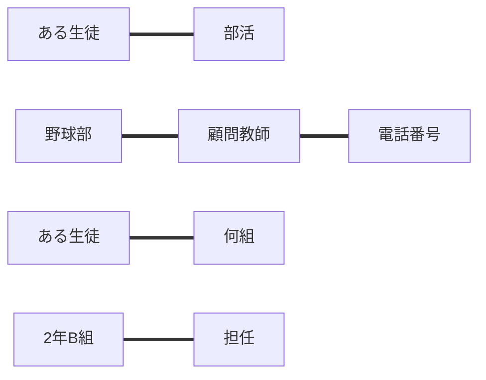
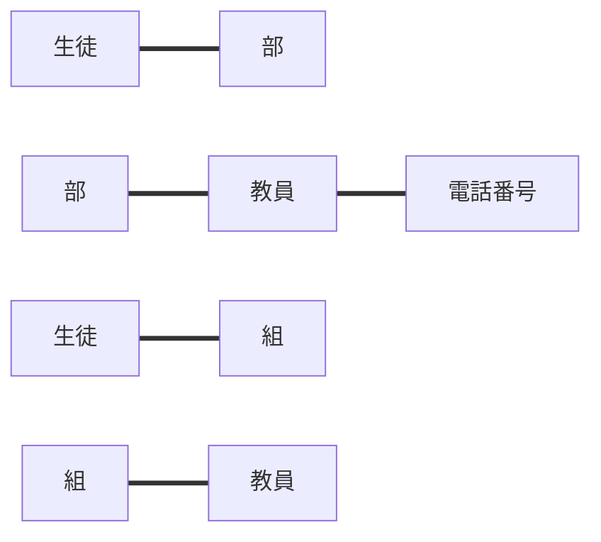
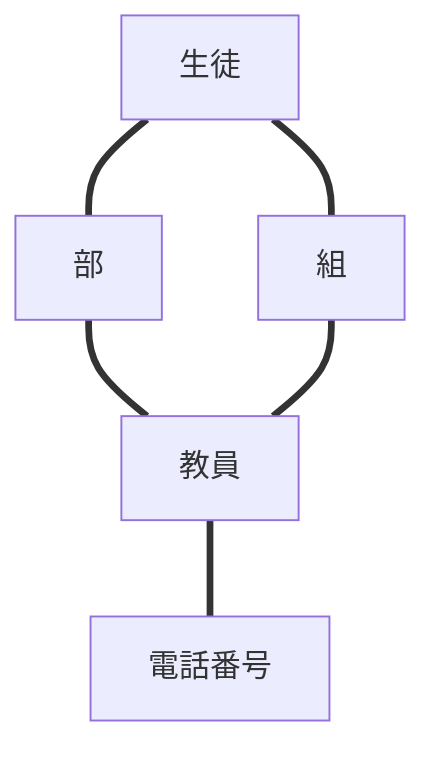
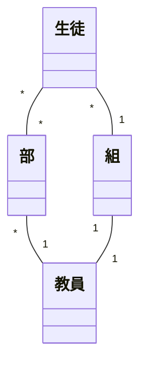
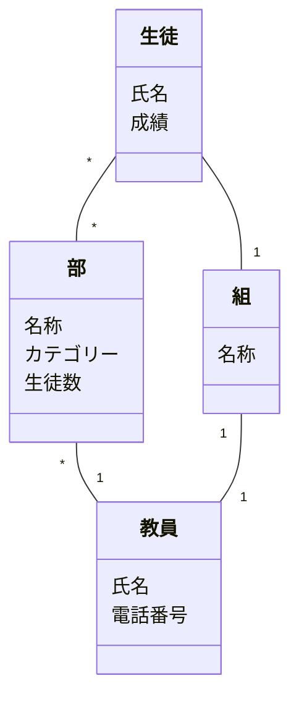

# オブジェクトの抽出

学校名簿アプリケーションを例とする。

## アプリケーションのタスクを抽出する

- ある生徒が所属している部活を確認する
- 野球部の顧問教師の電話番号を確認する
- ある生徒が何組かを確認する
- 2年B組の担任を確認する

## 「名詞」を抽出する

それぞれのタスクの文言から名詞を探す。

- ある生徒
- 部活
- 野球部
- 顧問教師
- 電話番号
- 何組
- 2年B組
- 担任

その際に、ユーザーの関心の対象となる概念は何か考える。単純に名詞を抜き出すのではない。

## 「名詞」とそれらの関係を抽出する

名詞同士の関係を整理する。

## 「名詞」を汎化し、粒度を揃える

名詞から共通項を見つけて、何か別の1つの名詞にできないかを考える。

## 「名詞」の関係性をつなげ、オブジェクトを特定する

## オブジェクトの中で「メインオブジェクト」になるものを特定する

オブジェクトの優先度を考える。

この例では複数のオブジェクトの中から部、生徒、教員、組をメインオブジェクトとして扱うようにして、電話番号はサブオブジェクトとみなしている。

## メインオブジェクトの多重性を特定する

## メインオブジェクトに付随するオブジェクトをプロパティとする

サブオブジェクトをプロパティとして、メインオブジェクトと関連付ける。

## タスクからアクションを見つける

あとで書く
