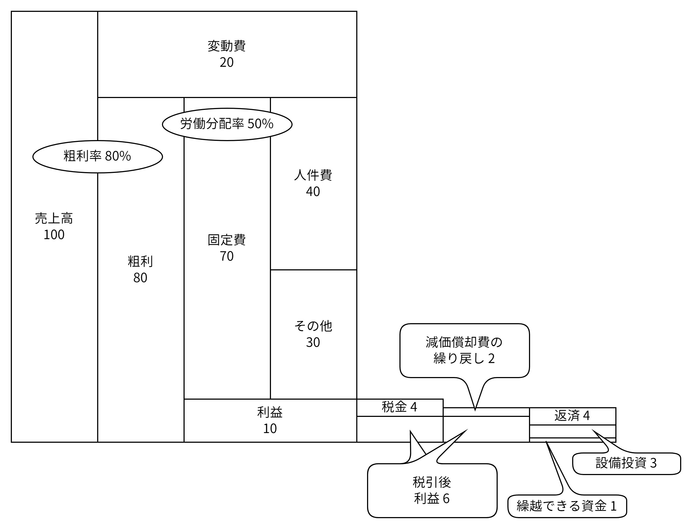

# お金の流れ

## 全体像



### Point

1. 売上高が確保できるところから考える
1. 粗利率は商品や事業内容に変更がない限り、通常は毎年ほぼ一定である。
    - ※変動費は売上高の増減に比例して増減する。（承認や材料の仕入れ、外注費など）
1 . 粗利から固定費を引いたものが利益。利益を確保するには、固定費を「粗利 - 利益」以内に抑える必要がある。
    - ※固定費は売上高の増減にあまり関係なく固定的に発生する。よって、売上高が減少すると、自動的に利益は圧縮される。
1. 利益のうち、1～4割程度を税金として納める。
1. その他の固定費に組み込まれていた減価償却費は、お金の支出は伴わない費用なので、資金繰りを見るときは繰り戻す。
1. 税引後利益に減価償却費を加えたもの（本業によるキャッシュフロー）から、設備投資や借入金の返済、次期繰越の資金にあてる。
    - ※実際には、在庫や売掛金・買掛金の増減なども資金繰りに大きく影響を与えるが、図にあらわしにくいため省略。

## 用語

固定費

:   売上や販売数の増減に関係なく一定額発生する費用

変動費

:   売上や販売数の増減に応じて比例的に増減する費用

減価償却費

:   固定資産（建物、機械、車両など）を使用することで生じる費用の一部です。固定資産の価値が時間の経過とともに減少していくため、その減少分を費用として計上するのが減価償却費です。

## 計算式

粗利率

```txt linenums="0"
粗利 / 売上高 * 100
```

労働分配率

```txt linenums="0"
人件費 / 粗利 * 100
```
